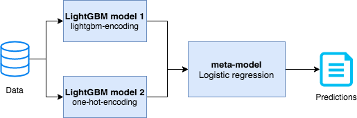

# International Data Analysis Olympiad 2019 - online round

## Results
25th place on the first track (out of 1315 participants)

40 place on the overall leaderboard (sum of track 1 and track 2) (out of 1315 participants)
## Task description:
The task is to build a classifier that would distinguish muons from non-muons in the [LHCb detector.](https://en.wikipedia.org/wiki/LHCb_experiment)

[Full task description + features explanation](https://docs.google.com/document/d/1d42hY3iGHB-Ncv4WySPCFKwPrXWLRL7z-ZKqBRV6yLw/edit?usp=sharing)

## Solution description:
[Stacking](https://www.geeksforgeeks.org/stacking-in-machine-learning/) of 2  models:
1. LightGBM model trained on lightgbm-encoded categorical features.

   HyperParameters:{'max_depth':7, 'objective':'binary', 'learning_rate':0.2,'num_leaves':64,'min_data_in_leaf':15, 'num_iterations':90}
2. LightGBM model trained on one-hot-encoded categorical features.

   HyperParameters:{'max_depth':9, 'objective':'binary', 'learning_rate':0.2,'num_leaves':128,'min_data_in_leaf':15, 'num_iterations':90}

## Features generation
1. P_PT = P - PT. 

   The difference between momentum and the component of the momentum, which is parallel to the beam.
2. P_PT_P = (P - PT) / P. 

   Same as above, normalized by momentum.
3. closest_{x/y/T/z/dx/dy}_per_station. 

   The {X,Y,Z} positions, timing (T) and uncertainty of the Matched hit coordinates, also known as pad size of the closest hit for each of 4 stations